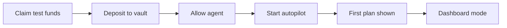

# Gardenaz App

Consumer-facing Next.js app for Gardenaz on Mantle Sepolia.

The app is now built around a simple first-time flow for non-technical users:

1. claim test funds
2. move funds into the vault
3. allow the agent
4. start autopilot and generate the first plan

After setup, the app hides onboarding and switches to a simpler dashboard.

## What the app owns

- wallet connection
- first-time onboarding UX
- wallet balance vs vault balance explanation
- vault actions: claim, deposit, withdraw, allow agent
- autopilot planning UI
- latest decision and history surfaces

## Important product model

- `Wallet balance` means funds still sitting in the user's wallet.
- `Vault balance` means funds already deposited and available for the agent to manage.
- The agent does not manage wallet funds directly.
- The agent only works with vault funds and only after operator approval.

## User flow



## App surfaces

- `Start Here`
  - first-time checklist and assistant guide
- `Canvas`
  - visual garden layer
- `Shop`
  - vault balances, vault actions, manual position controls
- `Audit`
  - history and proof

## Environment

Use [app/.env.example](/E:/web3/gardenaz/app/.env.example) as the baseline.

Minimal local setup:

```bash
NEXT_PUBLIC_PRIVY_APP_ID=
NEXT_PUBLIC_MANTLE_RPC_URL=https://rpc.sepolia.mantle.xyz
AGENT_SERVICE_URL=http://localhost:8787
```

The app will fall back to [mantle-sepolia.json](/E:/web3/gardenaz/app/src/lib/contracts/mantle-sepolia.json) for deployed contract addresses unless explicit env overrides are provided.

## Deployed contracts used by default

- `GardenUsdMock`: `0x66cE4A644e004830887C3E8a44Fd5122B1edb28B`
- `GardenRwaMockVault`: `0x376368699aF13e6492b2A330e1d8e5D6560e38a8`
- `SteadyAdapter`: `0x23F83a27674E9776Ab663b10e3745DD682858f29`
- `GrowthAdapter`: `0x744F554EfEA9cE87E459E4a927Ba7F1fb85669c5`
- `BoostAdapter`: `0x9FD80B063C4d28fDbc592C7f4E4BA7F6f8166DEc`

## Development

```bash
npm install
npm run dev
```

## Verification

```bash
npm exec tsc --noEmit
npm exec tsx -- --test "src/app/(app)/app/page.test.ts"
npm exec tsx -- --test src/lib/agent/autopilot.test.ts
```
