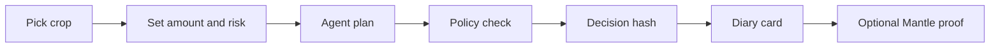

# Gardena App

Consumer web app for **Gardena**, an AI x RWA yield garden on Mantle.

Current local path: `/root/projects/Gardenaz/app`

Standalone repo: `Gardenaz/app`

Gardena App is the user-facing product layer. It turns Mantle RWA and mETH yield strategies into a friendly crop interface: users pick Rice, Corn, or Chili, set risk preference, request an agent plan, view the AI Farmer Diary, and see decision hashes that can be anchored on-chain.

## Track fit

- Primary: **AI x RWA** — dynamic yield strategy UX for USDY and mETH on Mantle.
- Secondary: **Consumer & Viral DApps** — gamified crop selection, proof diary, shareable harvest framing.
- Supporting: **Agentic Wallets & Economy** — bounded agent decision flow with wallet and policy context.

## Project boundary

This repo owns App concerns only:

- product UI and interaction flow.
- wallet connection via RainbowKit/wagmi.
- crop strategy UX for USDY, mETH, and dynamic USDY/mETH routes.
- agent planning API integration.
- local decision persistence and history display.
- on-chain anchor trigger/read helpers.

It does not own:

- LangGraph orchestration internals — see `Gardenaz/agent`.
- Solidity contracts — see `Gardenaz/contracts`.
- contract deployment scripts.
- live protocol execution adapters.

## Stack

- Next.js 16
- React 19
- Tailwind CSS v4
- RainbowKit
- wagmi
- viem
- Framer Motion
- Lucide React
- `@gardena/agent` from `github:Gardenaz/agent`

## Architecture

```mermaid
flowchart TD
    User[User] --> UI[Gardena App]
    UI --> Wallet[RainbowKit wallet]
    UI --> Crops[Crop strategy UI]
    Crops --> PlanAPI[/api/agent/plan]
    PlanAPI --> Agent[Gardena Agent]
    Agent --> LangGraph[LangGraph decision pipeline]
    LangGraph --> Decision[AgentDecision + decisionHash]
    Decision --> Store[Local decision store]
    Decision --> Diary[AI Farmer Diary]
    Decision --> Anchor[On-chain anchor helper]
    Anchor --> Contracts[DecisionLog on Mantle]
```

<details>
<summary>ASCII version</summary>

```text
User
  |
  v
Gardena App
  |-- wallet connection
  |-- crop strategy UI: Rice / Corn / Chili
  |-- /api/agent/plan ---> Gardena Agent LangGraph
  |                         |
  |                         v
  |                    AgentDecision + hash
  |
  |-- local history / AI Farmer Diary
  |-- optional anchor helper ---> DecisionLog on Mantle
```
</details>

## User journey



## Crop strategies

- Rice / Safe Harvest
  - asset: `USDY`
  - route: `Mantle RWA USDY Route`
  - risk: low
  - consumer framing: calm harvest proof
- Corn / Growth Field
  - asset: `mETH`
  - route: `Mantle mETH Yield Route`
  - risk: medium
  - consumer framing: growth streak
- Chili / Boost Farm
  - asset: `USDY/mETH`
  - route: `Mantle Dynamic RWA Route`
  - risk: higher
  - consumer framing: spicy rebalance

## API routes

- `POST /api/agent/plan`
  - calls `runAgent()` from `@gardena/agent`.
  - saves returned decision.
  - attempts optional anchor via `maybeAnchorDecision()`.
- `GET /api/agent/history`
  - returns stored agent decisions.
- `GET /api/health`
  - returns app health/config readiness.

## Key files

- `src/app/page.tsx` — landing/app console prototype with AI x RWA and proof-diary copy.
- `src/components/sections/hero-energy.tsx` — production hero section.
- `src/components/sections/crop-grid.tsx` — crop strategy section.
- `src/components/base/crop-card.tsx` — RWA strategy cards.
- `src/components/sections/agent-planner.tsx` — planner form and decision display.
- `src/components/sections/agent-history.tsx` — decision history UI.
- `src/lib/crops/data.ts` — USDY/mETH strategy metadata.
- `src/lib/agent/types.ts` — app-local AgentDecision types.
- `src/lib/agent/anchor.ts` — on-chain anchor helper.
- `src/lib/agent/store.ts` — decision store.
- `src/lib/wagmi.ts` — wallet and Mantle client config.

## App -> Agent contract

Request:

```ts
type AgentIntent = {
  user: `0x${string}`;
  crop: "steady" | "growth" | "boost";
  amount: string;
  riskPreference: 1 | 2 | 3;
};
```

Response:

```ts
type AgentDecision = {
  intent: AgentIntent;
  plan: {
    strategyId: string;
    title: string;
    riskLevel: 1 | 2 | 3;
    protocol: string;
    action: string;
    asset: string;
    expectedApy: string;
    steps: string[];
    explanation: string;
    consumerTheme?: string;
    shareLabel?: string;
    trackFit?: string;
  };
  policy: {
    allow: boolean;
    status: "approved" | "blocked";
    reason: string;
    checks: Array<{ label: string; pass: boolean; detail: string }>;
  };
  decisionHash: `0x${string}`;
  summary: string;
  createdAt: string;
};
```

## Environment

```bash
NEXT_PUBLIC_WALLETCONNECT_PROJECT_ID=
NEXT_PUBLIC_MANTLE_RPC_URL=
```

Optional server/on-chain values may be provided through Agent/Contracts deployment config when anchor execution is enabled.

## Development

```bash
pnpm install
pnpm dev
```

Dev server uses port `3000`.

## Verification

```bash
pnpm typecheck
pnpm build
```

## Package scripts

```json
{
  "dev": "next dev --port 3000",
  "build": "next build --webpack",
  "start": "next start",
  "lint": "next lint",
  "typecheck": "tsc --noEmit"
}
```

## Current execution status

- UI: implemented for AI x RWA + Consumer & Viral DApps framing.
- Agent plan API: implemented through `@gardena/agent`.
- Decision hash display: implemented.
- Local history: implemented.
- On-chain anchor helper: present.
- Real fund movement: not enabled in App MVP.
- Bybit/CEX trading: not used in App MVP; architecture remains Mantle-native for AI x RWA.
