# Gardenaz

**AI-Powered DeFi Dashboard on Mantle** — A gamified farming-island experience where users plant "crops" (DeFi strategies), watch them grow, and harvest yield. Designed to be intuitive and easy to use for most of user.

> Mint farm positions. Grow yield. Harvest proof.

---

## Table of Contents

- [Overview](#overview)
- [Architecture](#architecture)
- [How It Works](#how-it-works)
- [Crop-to-DeFi Mapping](#crop-to-defi-mapping)
- [Tech Stack](#tech-stack)
- [Project Structure](#project-structure)
- [Getting Started](#getting-started)
- [Environment Variables](#environment-variables)
- [Smart Contracts](#smart-contracts)
- [Agent Service](#agent-service)
- [Design System](#design-system)
- [Animation System](#animation-system)
- [Weather System](#weather-system)
- [Testing](#testing)
- [Known Issues](#known-issues)
- [Roadmap](#roadmap)
- [License](#license)

---

## Overview

Gardenaz wraps complex DeFi operations behind a cozy farming-island game. Instead of navigating liquidity pools, swaps, and yield strategies directly, users:

1. **Choose a crop** — Rice (safe), Corn (balanced), or Chili (aggressive)
2. **Deposit funds** — Move USDC from wallet to vault
3. **Authorize the agent** — Let the AI farmer manage your vault funds
4. **Watch it grow** — The island visually reflects your position state
5. **Harvest yield** — Collect returns with on-chain proof

The AI agent generates strategy plans, executes them on Agni Finance (Mantle DEX), and anchors decisions on-chain for full transparency.

---

## Architecture

### High-Level System Flow

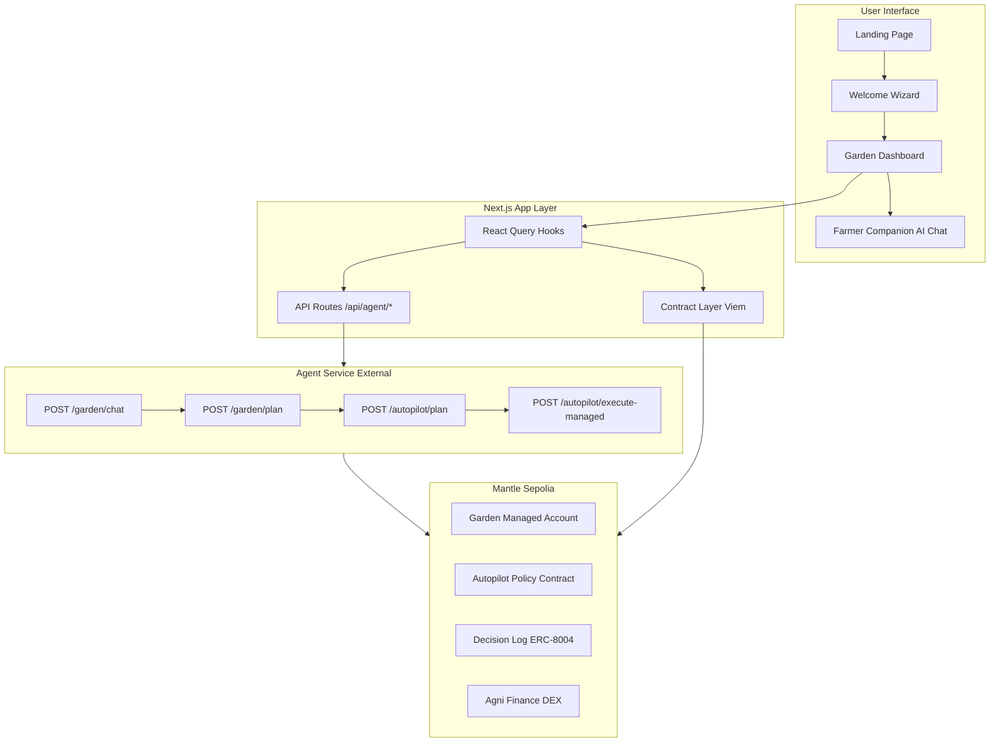

### User Onboarding Flow

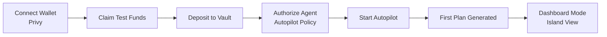

### Decision Execution Flow

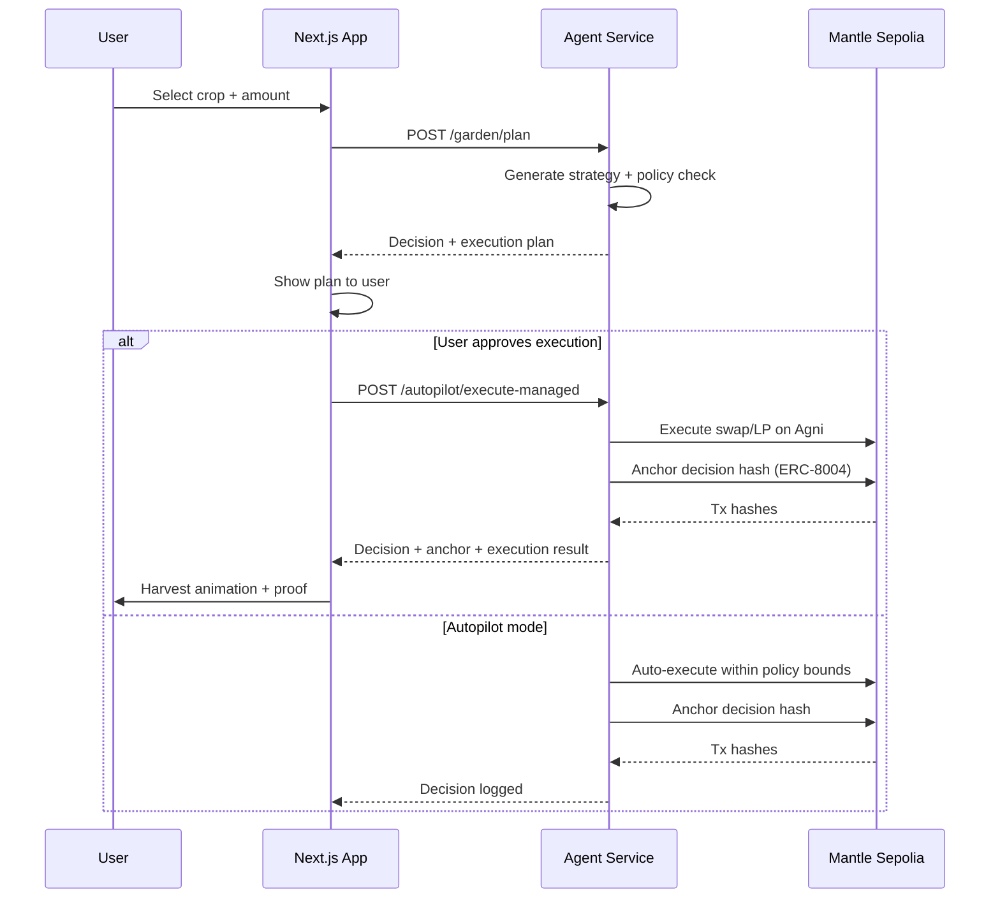

### Island Rendering Layers

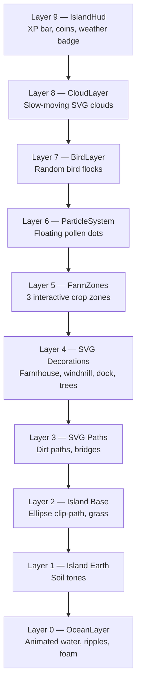

---

## How It Works

### Product Model

| Concept | Meaning |
|---------|---------|
| **Wallet Balance** | Funds still in the user's wallet, untouched by the agent |
| **Vault Balance** | Funds deposited and available for the agent to manage |
| **Crop** | A DeFi strategy metaphor — Rice, Corn, or Chili |
| **Growth** | Strategy position maturing over time |
| **Harvest** | Collecting yield from a mature position |
| **Proof** | On-chain decision anchor (ERC-8004) for transparency |

The agent **never** manages wallet funds directly. It only operates on vault funds after explicit user approval through the Autopilot Policy contract.

### Crop Lifecycle

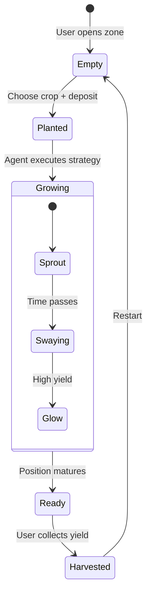

---

## Crop-to-DeFi Mapping

| Crop | CropId | Risk | Asset | Strategy | APY |
|------|--------|------|-------|----------|-----|
| Rice | `steady` | Low (1) | USDC | Agni Stablecoin Route | 4–6% |
| Corn | `growth` | Medium (2) | WMNT | Agni WMNT Growth Route | 7–11% |
| Chili | `boost` | High (3) | USDC/WMNT LP | Agni Dynamic LP Route | 12–20% |

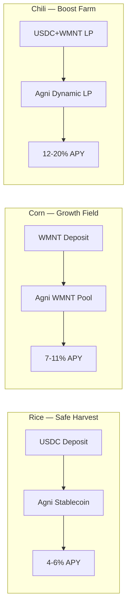

---

## Tech Stack

| Layer | Technology |
|-------|-----------|
| Framework | Next.js 16 + React 19 (App Router) |
| Language | TypeScript 5.8 |
| Styling | Tailwind CSS 4 (CSS-first, no config file) |
| Animations | Framer Motion 11 |
| Data Fetching | TanStack React Query 5 |
| Wallet Auth | Privy (`@privy-io/react-auth`) |
| Web3 | Viem (Mantle Sepolia, chain ID 5003) |
| Agent SDK | `@gardenaz/agent-sdk` + `@gardenaz/agent-types` |
| Icons | Lucide React |
| UI Primitives | Radix UI |
| Test Runner | `tsx --test` |

---

## Project Structure

```
app/
├── src/
│   ├── app/
│   │   ├── (landing)/            # Landing page
│   │   ├── (app)/
│   │   │   ├── app/
│   │   │   │   ├── page.tsx       # Redirects to /app/garden
│   │   │   │   ├── garden/        # Garden dashboard (island view)
│   │   │   │   ├── history/       # Decision history & proof
│   │   │   │   ├── quests/        # Quest progression
│   │   │   │   ├── garden-context.tsx
│   │   │   │   └── layout.tsx
│   │   │   └── settings/
│   │   ├── globals.css            # Design tokens + Island palette
│   │   └── layout.tsx
│   ├── components/
│   │   ├── island/
│   │   │   ├── island-canvas.tsx  # Main layered island scene
│   │   │   ├── island-terrain.tsx
│   │   │   ├── ocean-layer.tsx    # Animated water background
│   │   │   ├── decorations.tsx    # Farmhouse, windmill, dock, trees
│   │   │   ├── particle-system.tsx
│   │   │   ├── birds.tsx
│   │   │   └── harvest-burst.tsx
│   │   ├── gamification/          # Quest board, wooden buttons, parchment panels
│   │   ├── base/
│   │   │   ├── farmer-companion/  # AI chat companion
│   │   │   ├── privy-connect-button.tsx
│   │   │   ├── providers.tsx
│   │   │   ├── crop-card.tsx
│   │   │   ├── metric-pill.tsx
│   │   │   └── system-status.tsx
│   │   └── onboarding/
│   │       └── welcome-wizard.tsx
│   ├── hooks/
│   │   ├── use-garden-agent.ts    # Garden mutation hook
│   │   ├── use-agent-plan.ts      # Autopilot plan hook
│   │   ├── use-agent-history.ts   # Decision history
│   │   ├── use-autopilot-policy.ts
│   │   ├── use-fear-greed.ts      # Market mood → weather
│   │   ├── use-privy-wallet-address.ts
│   │   ├── use-privy-wallet-client.ts
│   │   └── use-health.ts
│   └── lib/
│       ├── agent/
│       │   ├── types.ts           # Core types (AgentDecision, CropId, etc.)
│       │   ├── service.ts         # Agent service API calls
│       │   ├── autopilot.ts       # Autopilot policy types & defaults
│       │   ├── store.ts           # Local decision persistence
│       │   ├── anchor.ts          # Decision anchoring (ERC-8004)
│       │   ├── history.ts         # On-chain history fetching
│       │   └── assistant-summary.ts
│       ├── contracts/
│       │   ├── config.ts          # Contract address resolution
│       │   ├── mantle-sepolia.json # Deployed addresses + ABIs
│       │   ├── garden-usd.ts      # gUSD token ABI
│       │   ├── garden-rwa.ts      # RWA vault helpers
│       │   ├── garden-managed-account.ts
│       │   └── autopilot-policy.ts
│       ├── crops/data.ts          # Crop definitions & metadata
│       ├── privy.ts               # Privy client config
│       ├── env.ts                 # Environment variable validation
│       └── motion.ts              # Framer Motion presets
├── docs/
│   ├── DESIGN_GUIDE.md
│   ├── AUDIT.md
│   └── PROJECT_CONTEXT.md
├── public/                        # Static assets (pak-tani.png, agni.png, videos)
└── package.json
```

---

## Getting Started

### Prerequisites

- Node.js 18+
- npm or pnpm

### Installation

```bash
cd app
npm install
```

### Configuration

Copy the example environment file and fill in your values:

```bash
cp .env.example .env
```

See [Environment Variables](#environment-variables) for details.

### Run Development Server

```bash
npm run dev
```

The app will be available at `http://localhost:3000`.

---

## Environment Variables

| Variable | Required | Description |
|----------|----------|-------------|
| `NEXT_PUBLIC_PRIVY_APP_ID` | Yes | Privy authentication app ID |
| `NEXT_PUBLIC_PRIVY_CLIENT_ID` | Yes | Privy client ID |
| `NEXT_PUBLIC_MANTLE_CHAIN_ID` | No | Chain ID (default: `5003`) |
| `NEXT_PUBLIC_MANTLE_RPC_URL` | No | Mantle Sepolia RPC (default: `https://rpc.sepolia.mantle.xyz`) |
| `AGENT_SERVICE_URL` | Yes | Agent service base URL (e.g. `http://localhost:8787`) |
| `AGENT_ANCHOR_ONCHAIN` | No | Anchor decisions on-chain (default: `true`) |
| `NEXT_PUBLIC_AGENT_IDENTITY_ADDRESS` | No | Override: Agent identity contract |
| `NEXT_PUBLIC_DECISION_LOG_ADDRESS` | No | Override: Decision log contract |
| `NEXT_PUBLIC_AUTOPILOT_POLICY_ADDRESS` | No | Override: Autopilot policy contract |
| `NEXT_PUBLIC_GARDEN_MANAGED_ACCOUNT_ADDRESS` | No | Override: Managed account contract |
| `NEXT_PUBLIC_GARDEN_DEPOSIT_TOKEN_ADDRESS` | No | Override: Deposit token contract |
| `NEXT_PUBLIC_AUTOPILOT_EXECUTOR_ADDRESS` | No | Override: Executor/relayer address |

Minimal `.env`:

```bash
NEXT_PUBLIC_PRIVY_APP_ID=your_privy_app_id
NEXT_PUBLIC_PRIVY_CLIENT_ID=your_privy_client_id
NEXT_PUBLIC_MANTLE_RPC_URL=https://rpc.sepolia.mantle.xyz
AGENT_SERVICE_URL=http://localhost:8787
```

Contract addresses default to values in `src/lib/contracts/mantle-sepolia.json` unless overridden by environment variables.

---

## Smart Contracts

| Contract | Address | Purpose |
|----------|---------|---------|
| AgentIdentity | `0x9De017B94A1c8DF7e61db1390C6201E4040c0EB4` | ERC-8004 agent identity registry |
| DecisionLog | `0x25aBD0B013478CFB70D1bdEF6699A49794150541` | On-chain decision anchor |
| AutopilotPolicy | `0x81ffC99B5e72B9754F3E49EBe61a4C44f7C49D85` | User policy & risk limits |
| GardenManagedAccount | `0x07fE756599B75cEdAf767D8d8F5De99010e21D91` | Agent-managed vault account |

### ERC-8004 Decision Anchor Flow

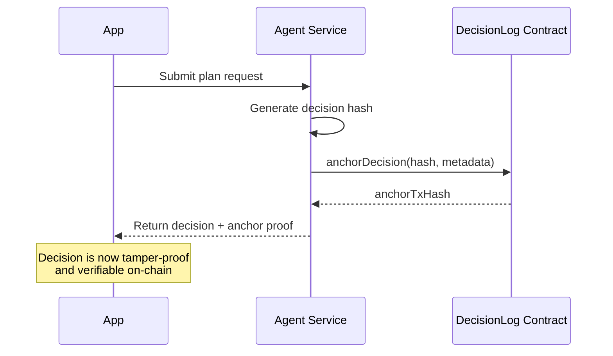

---

## Agent Service

The app communicates with an external **Agent Service** that handles:

| Endpoint | Method | Purpose |
|----------|--------|---------|
| `/garden/plan` | POST | Generate a garden strategy plan with simulation |
| `/autopilot/plan` | POST | Generate an autopilot DeFi plan |
| `/autopilot/execute-managed` | POST | Execute a plan via managed account |
| `/garden/chat` | POST | AI assistant chat (streaming supported) |
| `/readiness` | GET | Check agent service health |

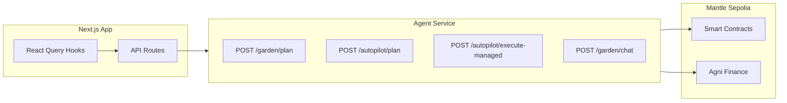

The agent service is **required** at runtime. If `AGENT_SERVICE_URL` is not set, plan requests will fail.

---

## Design System

### Philosophy

The UI follows a **warm, tactile, game-like** aesthetic — cozy, approachable, and fun. Avoid generic SaaS dashboard patterns.

### Typography

| Role | Font | Feel |
|------|------|------|
| Headings | Nunito | Rounded, game-like |
| Body | Nunito | Friendly, readable |
| Labels | Nunito | Clean, approachable |

### Color Tokens

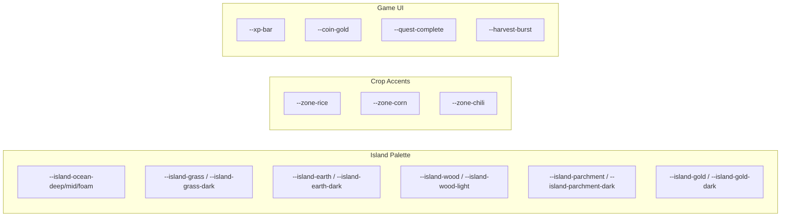

### Utility CSS Classes

| Class | Purpose |
|-------|---------|
| `.btn-wood` | Wood-textured button |
| `.panel-parchment` | Parchment card background |
| `.bubble-speech` | Speech bubble with tail |
| `.crop-meter` | Crop growth progress bar |
| `.island-hud` | HUD bar styling |

All tokens are defined in `src/app/globals.css` under the `/* Island palette */` section.

---

## Animation System

All interactive animations use **Framer Motion** (`motion.div`, `AnimatePresence`). Constants live in `src/lib/motion.ts`.

### Spring Presets

| Preset | Stiffness | Damping | Use Case |
|--------|-----------|---------|----------|
| `SPRING_CROP` | 280 | 22 | Crop zone interactions |
| `SPRING_UI` | 340 | 26 | Overlays, pickers |
| `SPRING_BUTTON` | 400 | 20 | Button press feedback |

### CSS Keyframe Animations

| Name | Target |
|------|--------|
| `ocean-swell` | OceanLayer |
| `windmill-spin` | Windmill SVG |
| `crop-sway` | FarmZone growth stage |
| `particle-float` | ParticleSystem |
| `harvest-pop` | HarvestBurst |
| `xp-rise` | XpFloat |
| `island-entrance` | IslandCanvas mount |
| `water-ripple` | OceanLayer rings |
| `bird-fly` | BirdLayer |

> **Convention:** Never use raw CSS `animation:` for interactive elements. Always use Framer Motion.

---

## Weather System

The island's weather is derived from the **Fear & Greed Index** (0–100):

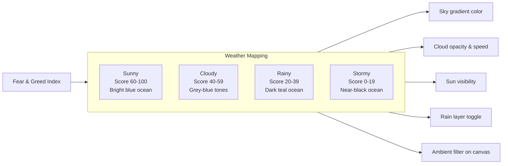

| Score Range | Weather | Ocean Tone | Sky Tone | Visual Effect |
|-------------|---------|------------|----------|----------------|
| 60–100 | Sunny | Bright blue | Light blue | Sun glow, no rain |
| 40–59 | Cloudy | Mid blue-grey | Grey-blue | Dimmed, cloud layer |
| 20–39 | Rainy | Dark teal | Dark grey | Rain layer active |
| 0–19 | Stormy | Near-black | Very dark | Heavy rain + dark filter |

---

## App Surfaces

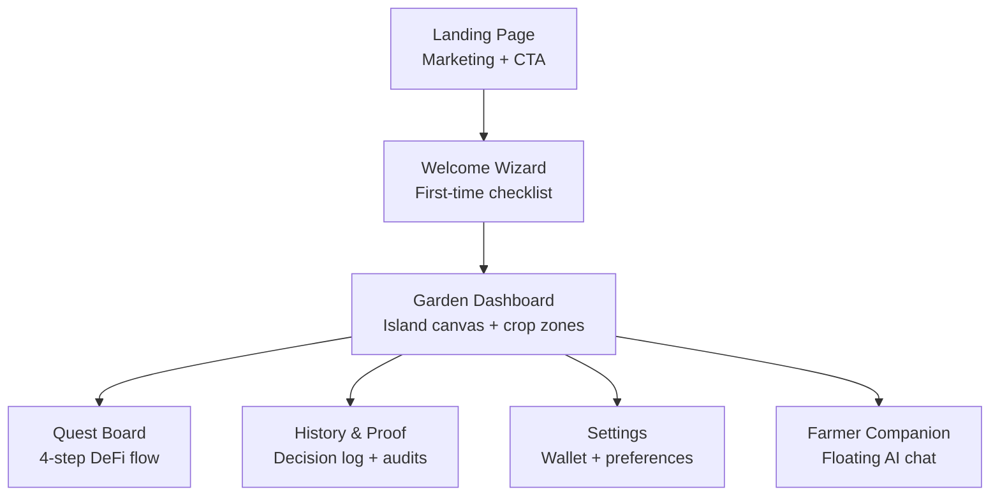

| Surface | Route | Description |
|---------|-------|-------------|
| Landing | `/` | Marketing page with hero video |
| Welcome Wizard | `/app/welcome` | First-time onboarding checklist |
| Garden Dashboard | `/app/garden` | Main island canvas + crop zones |
| Quests | `/app/quests` | 4-step DeFi quest flow |
| History | `/app/history` | On-chain decision proof & logs |
| Settings | `/settings` | Wallet connection + preferences |

---

## Testing

```bash
# Type checking
npm run typecheck

# Linting
npm run lint

# Run tests
npm run test

# Specific test files
npx tsx --test src/lib/agent/autopilot.test.ts
npx tsx --test src/lib/launch/settings-state.test.ts
npx tsx --test src/lib/agent/history.test.ts
npx tsx --test src/lib/fear-greed.test.ts
npx tsx --test src/lib/agent/assistant-summary.test.ts
```

---

## Known Issues

1. **Full typecheck is blocked** — Type mismatch in `anchorTxHash` and missing UI dependencies
2. **Garden flow requires `AGENT_SERVICE_URL`** — No local fallback if the agent service is unavailable
3. **On-chain proof is simulated** — `maybeAnchorDecision()` creates a fake tx hash; real ERC-8004 anchoring is not yet wired
4. **Decision persistence is local JSON** — Race-prone, no user scoping, not serverless-safe
5. **Design system inconsistency** — Parts of the app still use teal SaaS tokens instead of the Paper/Ghibli palette

---

## Roadmap

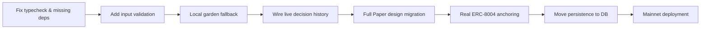

- [ ] Fix typecheck and missing dependencies
- [ ] Add input validation and error handling
- [ ] Add config guard or local fallback for agent service
- [ ] Replace hardcoded diary with live history
- [ ] Complete Paper garden design conversion across all surfaces
- [ ] Wire real DecisionLog ABI for on-chain anchoring
- [ ] Move decision persistence to a database (Supabase/KV)
- [ ] Night mode (dark palette based on stormy weather)
- [ ] Windmill speed tied to current APY
- [ ] Seasonal themes (swap SVG decorations per quarter)
- [ ] Leaderboard as wooden noticeboard overlay

---

## License

Private — All rights reserved.